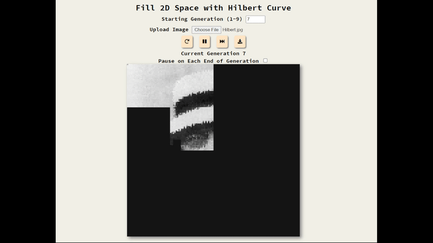

# Fill 2D Space with Hilbert Curve
I was introduced to the amazing world of `fractals` by a coding channel named `The Coding Train`. I was fascinated by the elegance of the process. It was an amazing mix of math, computer science, coding, and nature, all of which I admire a lot! This project is  about such a fractal pattern named `Hilbert Curve`.

I got to know about `Hilbert Curve` from my university's computer graphics course. As soon as I got introduced to the topic I searched the web for coding it. I coded Hilbert curve with `OpenGL` in `C++`, but it felt clumsy to set it all up. Then I remember `The Coding Train` and his work on `p5js` and `processing`. These libraries were primarily developed for easy use for creative coding. I played around with the libraries but never dedicated to do something serious with it; until now!

## About the Project
`Hilbert Curve` is a space-filling curve. That means this 1-D line can fill a 2-D space! This fact on its own is amazing! The time I was learning about the amazing properties of `Hilbert Curve`, I came across a `3Blue1Brown`'s video on this topic. Equipped with mathematical and algorithmic knowledge I was pumped to make something cool with it! This leads naturally to use `Hilbert Curve` to fill image space. In this project, the user can see the `Hilbert Curve` of various generations fill a `512x512` canvas. The hue mapping leads to a fascinating image of filled space.

> *Generation 6 Hilbert Curve being drawn with changing hue*

## Interact with the Project
- [Try the Project](https://ghcdn.rawgit.org/MzMahmud/fill-2d-space-with-hilbert-curve/master/index.html)

## Features
- **Starting Generation (1-9)**

    Users are able to set the starting generation. The number is limited to `1 to 9` because in `n`-th  generation hilbert cuve have  points. I ran the simulation with `n = 10` and it could not handle it. So `n in [1,9]` it is!

- **Upload Image**

    Users can upload any image to be filled with `Hilbert Curve`!
    
    
    > *Image of David Hilbert being drawn with Hilbert Curve*

- **Reset, Pause/Play, Fast Forward, Download as Image**
    `Reset` and `Pause/Play` are self-explanatory. `Fast Forward` allows the user to go through the animation at an increased speed. This is achieved by increasing the `iterationPerFrame` variable by an amount each time the user clicks the `Fast Forward` button. 
    
    `Download as Image` is also self-explanatory.

    
    > *Hilbert Curve of generation 6*

    
    >*Image of David Hilbert with generation 7 Hilbert Curve*

- **Pause on Each End of Generation**

    The name of the checkbox is pretty self-explanatory. I added this afterward so that I can easily download the output of each generation.

## Resources
If you are eager to learn more about the topic I would leave some links to read and see for yourself.

- [I used this Iterative algorithm for drawing Hilbert curve](http://blog.marcinchwedczuk.pl/iterative-algorithm-for-drawing-hilbert-curve)
- [3Blue1Brown's video](https://youtu.be/3s7h2MHQtxc)
- [The Coding Train's video](https://youtu.be/dSK-MW-zuAc)
